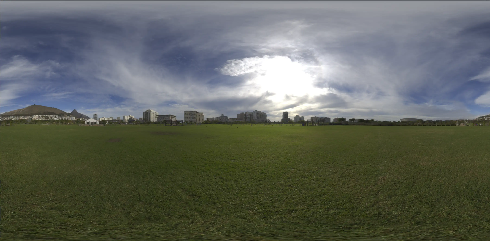
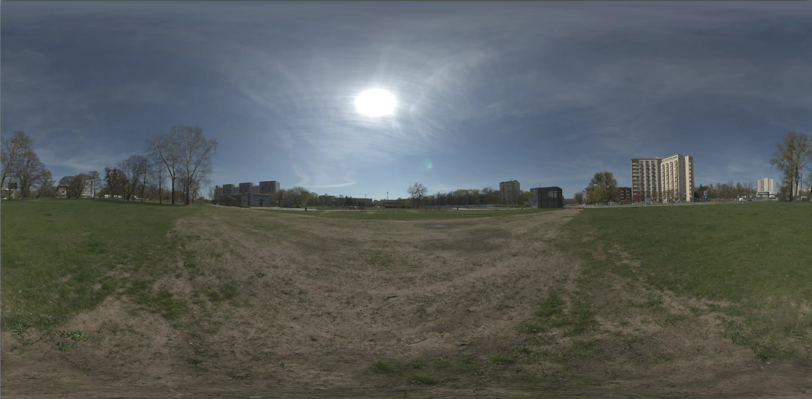
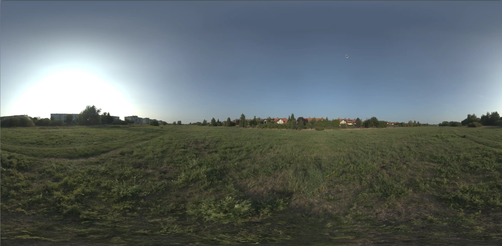

# Версия 1.0.0 - 2025-05-12

### Описание релиза
> Релиз 1.0.0 содержит важные улучшения в интерфейсе пользователя, добавлен новый объект сцены, расширен список нежелаемых изделий при генерации, добавлены новые окружения.

- Новый объект дом-заглушка

- Добавлено 3 новых окружения (`утренний город`, `городской парк`, `солнечная долина`)

- Изменено стартовое окружение (`утренний город`) и покрытие (`трава`)
- Убраны из генерации: урны, дорожные знаки, арки входные
- Исправлена ошибка при генерации скриншота (некорректный `mime-type`)

## Добавлено

### Новые сущности
- Добавлена сущность `boxHouse` (дом-заглушка)
  - дом-заглушка используется для имитации строений
  - возможность масштабировать объект по всем плоскостям
  - управление прозрачностью

### Функциональность
- Добавлен HTML-элемент `boxHouse` в панель манипуляции объектом, включающий:
  - Поля изменения габаритов
  - Чекбокс прозрачности
- Реализованы обработчики событий:
  - `input` для HTML-элемента `boxHouse`
  - `change` для чекбокса прозрачности `boxHouse`

### Новые функции
- `changeAllBoxHouseOpacity` - управление прозрачностью всех `boxHouse`
- `checkPlatformDimensionsChanged` - проверка изменения габаритов перед генерацией площадки

## Изменено

### Модификации функций
- `loadProject`:
  - Учтены масштабирование и прозрачность `boxHouse` при загрузке проекта
- `collateObjectProps`:
  - Добавлена передача данных `boxHouse` при их наличии в сцене
- `WebGLRenderer`:
  - Добавлено свойство `alpha = true`
- `deleteModel`:
  - Добавлено удаление соответствующего элемента `boxHouse`
- `initMIP`:
  - Создание HTMLElement для `boxHouse`
  - Инициализация функций `setBoxHousePanelVisibility` и `setBoxHouseOpacity`
- `atachTC`:
  - Сброс дальнейшей логики прикрепления MIP при фокусе на HTML-элемент `boxHouse`
  - Завершающим действием является вызов `MIP.setBoxHousePanelVisibility`
- `mainSection`:
  - Добавлена проверка нажатия на HTML-элемент с классом `mip-boxHouse__input` в событии `mousedown`
- `createObjectClone`:
  - Клонирование материала объекта-источника для `boxHouse`
  - Добавление объекта-клона в массив `boxHouses` (для обычных объектов добавляется `false`)
- `loadModel`:
  - Добавлен флаг `isBoxHouseDetected`
  - Добавлено условие для помещения объекта в массив `boxHouses` при наличии ребенка с именем `BoxHouse`
  - Применение свойств масштабирования и прозрачности для `boxHouse`-объектов из сохраненного проекта
  - Завершающим действием является `MIP.setBoxHousePanelVisibility`
- `AGT.changeColor`:
  - Изменены условия назначения оттенков для материала
- `placeImg onload`:
  - Изменен `mime-type` на `image/jpeg`
- `initGeneration`:
  - Добавлена проверка `checkPlatformDimensionsChanged` для изменения габаритов площадки

### Изменения в конфигурациях

- `delayedSetSceneBackground.dictionary`:
  - Добавлены свойства: `sun_valley`, `morning_town`, `city_park`
- `loadPlaneMaterial.selectedMaterial`:
  - Изменен стартовый материал на `grass`
- `placeGeneration.blacklist`:
  - Добавлены объекты категорий категорий: урны, дорожные знаки, арки входные

## Исправлено
- Устранены лишние вызовы смены геометрии площадки и назначения материалов при генерациях
- Запрещено использование урн, дорожных знаков и арок входных при генерациях
- Исправлен `mime-type` при сохранении скриншотов:
  - Ранее был указан неверный `mime-type`, что приводило к отсутствию маркеров на скриншотах:

      `ff d8 ff e0` - заголовочные маркеры

      `ff d9` - закрывающие маркеры 

      Так как отсутствовали маркеры такой скриншот не мог загружаться на сторонние ресурсы.
